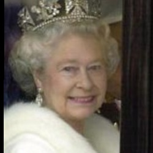
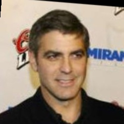

# Walking around the latent space of celebrity faces.

 

This is a generative model based on the Labelled Faces in the Wild dataset from Kaggle.
The dataset can be found in the link below.
https://www.kaggle.com/atulanandjha/lfwpeople

Originally,the data is an image collection of famous people on the Internet. The data consists of roughly 13000 images
spanning over 5000 celebrities. 
Some of the sample images are shown below.

  

The dataset was released as a classification problem in Computer Vision. However, i have used the data for an unsupervised learning task.

All the images have been reshaped into an rgb image of size (64,64,3).
The variational autoencoder model with 6 latent variables has been built in Keras. 
The model is trained only for 5 epochs. However ,if you try to train it further, it'll start overfitting badly.
I tried two optimizers ie Adagrad and Adam, wher both the optimizers stuck in a local minima(training loss couldn't 
decrease after reaching a loss of 600). However, using an Adadelta optimizer landed me around a loss of 460 after which it began stalling 
in the same range with not much overfitting.

After the model was trained, i saved the decoder weights and tested it using the trackbar function in OpenCV.
By interpolating between the values of the latent variables, the morphing of the images can be easily seen.
The decoder could indeed generate new images that it hadn't been shown during the training.
However, the images seem to be blurred(due to the humongous loss of 460). Nevertheless, the effect of interpolation on the 
latent variables do generate new samples.

